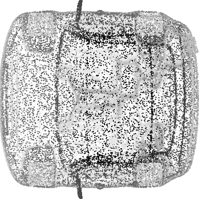
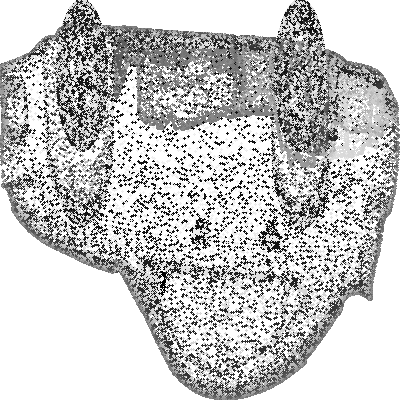
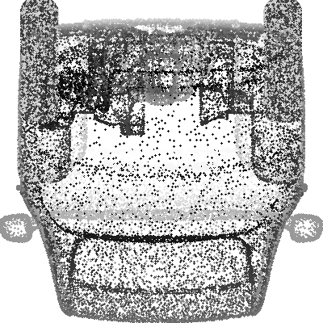
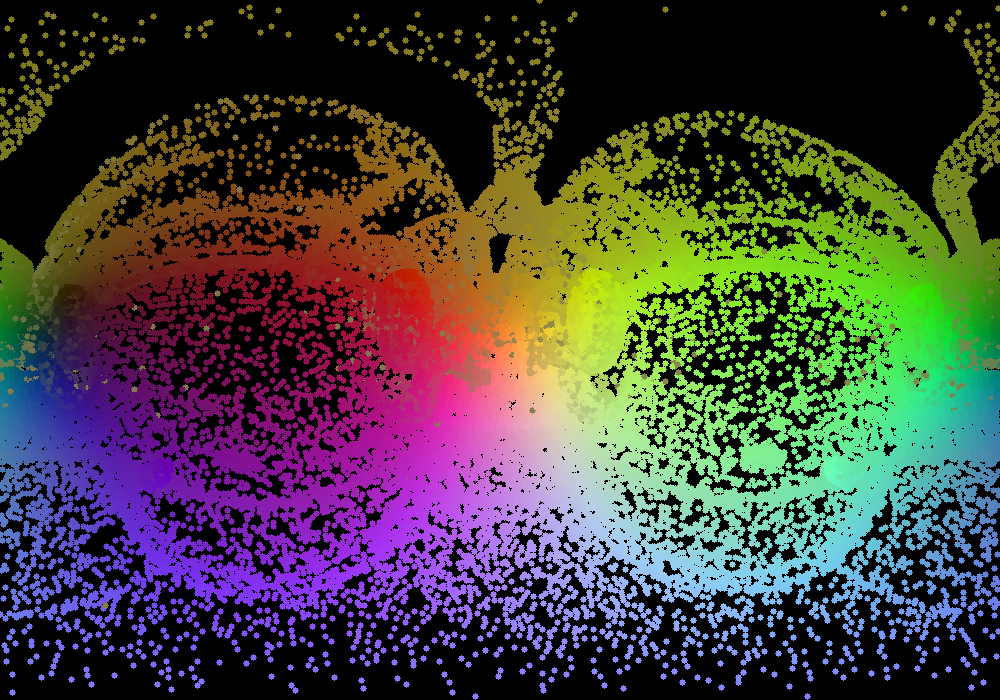
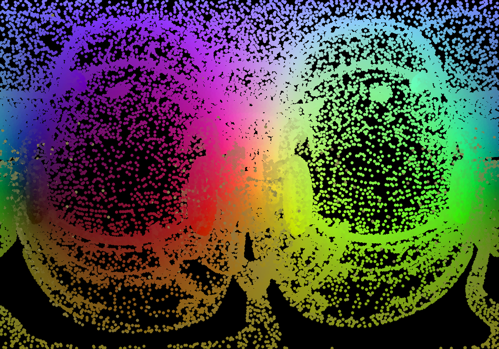

# Aero Drive

Решение команды **AI integration** трека 3 Расчет аэро- и газодинамики в ограниченном пространстве с использованием искусственного интеллекта.

Этот репозиторий содержит все файлы, необходимые для воспроизведения наших экспериментов и работы итогового продукта. Если Вы хотите проверить эксперимент, то перейдите в папку **train** и следуйте инструкции. Если же хотите запустить продукт с обученными моделями, то перейдите в папку **inference** и следуйте инструкции.

**Результат на валидации: 0.0153**

---

## Описание решения

Мы используем 3D модели машин для генерации 5 изображений:  
1. **3 grayscale проекции** с разных сторон, где значение точки определяется как расстояние до проекционной плоскости.  
2. **Сферическая и цилиндрическая RGB развёртка модели.**

Все затратные вычисления реализованы на многопоточном коде на языке C++, что обеспечивает невероятную скорость генерации изображений по 3D модели (1000 моделей за 1 минуту).

Примеры сгенерированных изображений:  

### Grayscale проекции
<div style="display: flex; justify-content: center;">
  
  
  
</div>

### RGB развёртки
<div style="display: flex; justify-content: center;">
  
  
</div>


---

Мы обучили на этих данных две предобученные модели с измененными первым слоем с 9 каналами на вход(3 канала grayscale проекций, 3 RGB сферической проекции, 3 RGB цилиндрической проекции) и последним слоем с 1 выходом:  
- **ResNet18**  
- **EfficientNetB1**  

Обе модели используются для предсказания коэффициента аэродинамического сопротивления. После этого был обучен ансамбль лёгковесных моделей на выходах двух нейросетей. Этот подход позволяет гибко балансировать между качеством и скоростью работы алгоритма.  

- **Для быстроты** используйте **EfficientNet**.  
- **Для высокого качества** используйте весь пайплайн, который мы назвали **AERONET**.

## Предподготовка данных

В подрепозитории train уже скачиваются предобработанные данные в виде 5 картинок на одну модель. Для того, чтобы получить из 3д модели данные подходящие для обучения и инференса самостоятельно необходимо сделать следующее:

1. Скачать 3д модели в формате .stl в папку stl_dir
2. Если в моделях больше 100_000 точек, то следует выбрать случайные 100_000 точек. 
3. Установить необходимые зависимости для компиляции кода на c++: 
```bash
apt-get update && apt-get install -y \
    build-essential \
    g++ \
    libopencv-dev \
    libeigen3-dev \
    libassimp-dev \
    cmake \
    && apt-get clean
```
4. Скачать и скомпилировать файл **inference/src/mesh_projection_mt.cpp**:
```bash
g++ -std=c++17 -O2 -o mesh_projection_mt mesh_projection_mt.cpp \
    -I/usr/include/opencv4 \
    -I/usr/include/eigen3 \
    -lopencv_core \
    -lopencv_imgcodecs \
    -lopencv_highgui \
    -lopencv_imgproc \
    -lassimp \
    -pthread
```
5. Сделать директорию img_dir и выдать все необходимые права.
```bash
mkdir img_dir
chmod 777 img_dir
```
6. Исполнить скомпилированный файл с необходимыми аргументами:
```bash
./mesh_projection_mt stl_dir img_dir 3
```
